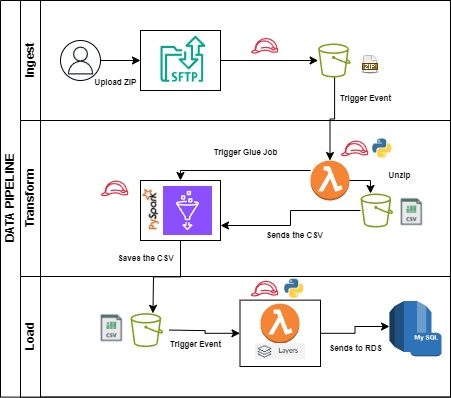
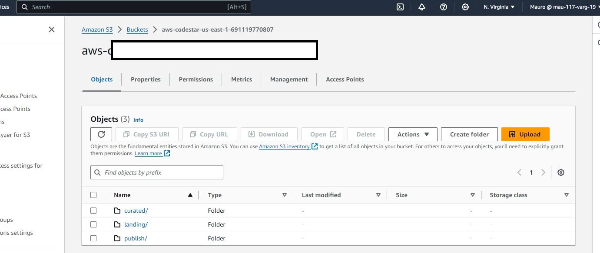
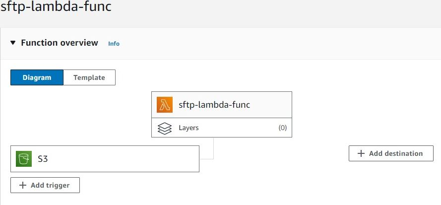
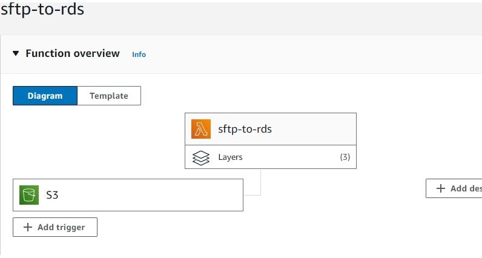
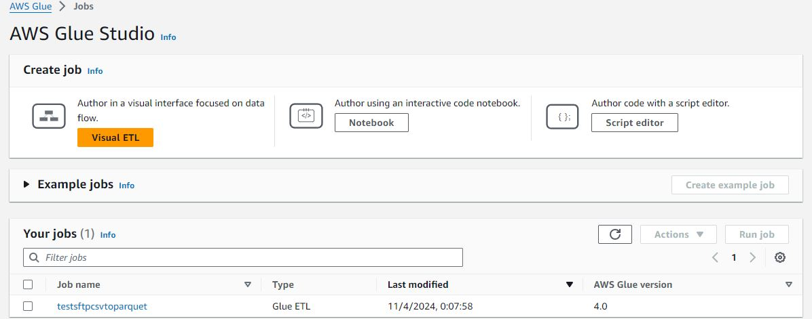
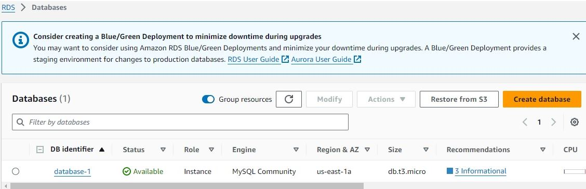

# AWS-SFTP-PIPELINE

ITL (ingestion, transformation and loading) Datapipeline using SFTP's, lambdas, and a gluespark job, in order to save data into an rds.

The Python.zip file contains the pymysql package in order to connect to the RDS thorugh the lambda function using a lambda layer, and the SQL_DBEAVER is the sql code to create the database and table.

This is the structure of the Data Pipeline:

This were the processes and resources created to build the DataPipeline.
The lambdas and the Glue Job have IAM roles, in order to extract data from s3 and process it.

